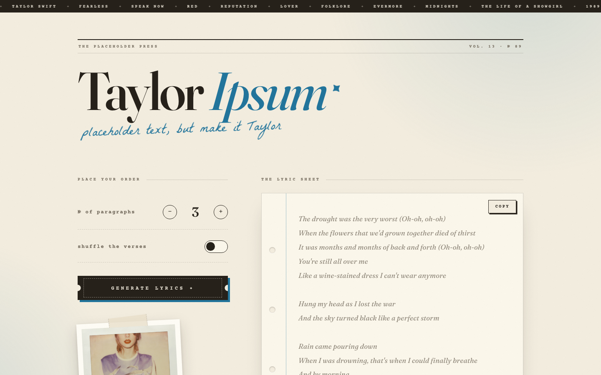
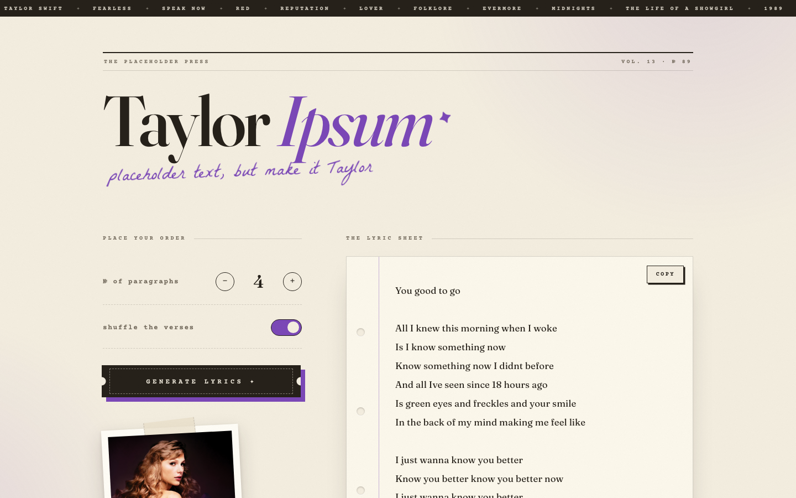

# Taylor Ipsum Generator

The Taylor Ipsum Generator is a Lorem Ipsum generator that uses Taylor Swift lyrics to create placeholder text for your projects. This project is built using React, Vite, and TypeScript and deployed on Cloudflare Pages.

The project gets the Taylor Swift lyrics using the [Taylor Swift API](https://github.com/sarbor/taylor_swift_api).

Every visit draws a random Taylor album. Its cover appears as a tape-mounted polaroid, the placeholder lyrics come from that album, and the album's era color tints the whole page — the subtitle ink, the button shadow, the lyric sheet's margin rule, and the background wash.

## Design

The interface is styled as **"The Lyric Press"** — vintage music ephemera, like a lyric booklet from a record shop:

- Warm grained-paper background with an era-colored wash
- A ticker tape across the top scrolling all of the album names
- A newspaper masthead above the title, with a handwritten script subtitle
- A ticket-stub generate button with notched, perforated edges
- A punch-holed lyric sheet with a rubber-stamp copy button and a word-count slip
- Typography: [Fraunces](https://fonts.google.com/specimen/Fraunces) for display and lyrics, [Courier Prime](https://fonts.google.com/specimen/Courier+Prime) for labels, and [La Belle Aurore](https://fonts.google.com/specimen/La+Belle+Aurore) for handwritten annotations

## View Live

This website is currently hosted using Cloudflare Pages here: https://taylor-ipsum-website.pages.dev

## Screenshots

## Getting Started

To get started with the project, follow these steps:

1. Clone the repository to your local machine.
2. Install dependencies: `npm install`
3. Start the dev server: `npm run dev`
4. Open `http://localhost:5173` in your browser.

## Project Structure

The project consists of the following files:

- `index.html`: The Vite HTML entry point (page metadata and font loading).
- `src/App.tsx`: The main React component — ticker, masthead, generator layout, polaroid, and footer.
- `src/main.tsx`: The React entry point.
- `src/style.css`: The styling for the web page.
- `src/features/generator/components`: Generator UI components (`GeneratorForm`, `LyricsOutput`, `CopyButton`).
- `src/features/generator/hooks/useLyricsQuery.ts`: React Query hook for fetching lyrics.
- `src/features/generator/hooks/useRandomAlbum.ts`: Picks the random album and applies its era accent colors.
- `src/api/lyrics.ts`: Lyrics API client.
- `src/config.ts`: API endpoint and generator defaults.
- `src/data/albums.ts`: Album lyrics, titles, and release years.
- `public/images`: Taylor album cover images.
- `public/fonts`: Aileron font files.

## Environment Variables

- `VITE_API_URL`: Optional override for the lyrics API. Defaults to the production API URL.

## Cloudflare Pages

Build settings for Cloudflare Pages:

- Framework preset: Vite
- Build command: `npm run build`
- Build output directory: `dist`

## How to Use

To generate Taylor Swift lorem ipsum text, follow these steps:

1. Set the number of paragraphs with the − / + stepper (or type a number).
2. Optionally flip on "shuffle the verses" to randomize the lyrics.
3. Click the "Generate Lyrics" ticket to print your text onto the lyric sheet.
4. Hit the "copy" stamp in the corner of the sheet to copy everything to your clipboard.
